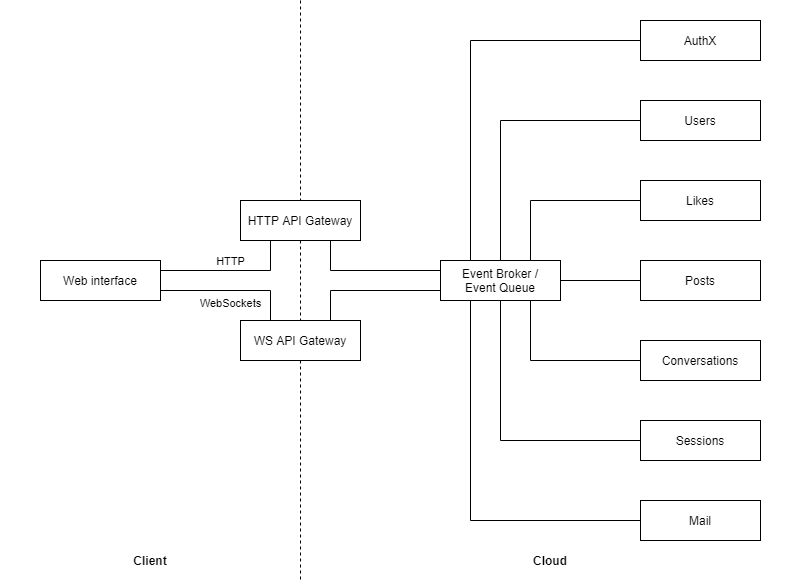

# Showcases

A repository containing showcases for my programming and architecture skills.

## TLDR

Create a `.env` file as shown below:

```ini
BROKER_URI=nats://nats:4222
SENDGRID_API_KEY=xxxxxxxxxxxxxxxx
SENDGRID_HTTP_URI=https://api.sendgrid.com/v3/mail/send
SPARKPOST_API_KEY=xxxxxxxxxxxxxxxx
SPARKPOST_HTTP_URI=https://api.eu.sparkpost.com/api/v1
AUTHORIZED_CREDENTIALS=user1:pass1,user2:pass2
MAIL_FROM=no-reply@mail.example.com
```

Afterwards run:

```shell
docker-compose up
```

Navigate to [localtest.me](http://localtest.me) and enjoy.

**DISCLAIMER:** The application does not have a visual UI and is mostly a demonstration and proof of concept for the proposed microservice architecture. You can test the application by sending the following requests while watching the log output of the `audit` service:

- `GET localtest.me/posts`
- `POST localtest.me/posts`
- `PUT localtest.me/posts/1`
- `POST localtest.me/posts/1`
- `DELETE localtest.me/posts/1`

Observe the subject / topic shown left of the `>>` and the `type` attribute of the cloud event. The gateway transforms the RESTful message to [CloudEvents](https://cloudevents.io/) for downstream processing. The convention followed is a classical RESTful CRUD interface.

## Architecture

The diagram below is the end-to-end architecture of the application showing the functional architecture building blocks and their connections.



Below you may find the proposed tech stacks for the different services.

| Service        | Technologies                                        |
| -------------- | --------------------------------------------------- |
| Web Interface  | Svelte, MaterialUI, Static Hosting                  |
| Broker / Queue | NATS                                                |
| HTTP API       | Go, Fiber, NATS                                     |
| WS API         | Go, Fiber, NATS                                     |
| AuhtX          | Go, [casbin](https://casbin.org/), Redis, JWT, NATS |
| Users          | Go, PostgreSQL, NATS                                |
| Likes          | Go, Redis, NATS                                     |
| Posts          | Go, PostgreSQL, NATS                                |
| Conversations  | Go, MongoDB, NATS                                   |
| Sessions       | Go, Redis, NATS                                     |
| Mail           | Go, SendGrid, NATS                                  |

### Future improvements

Below you may find a list of future improvements:

- Automated testing with a focus of integration testing
- Abstraction of broker and gateways protocols to allow for easy migration to other technologies, such as [GCP Pub/Sub](https://cloud.google.com/pubsub)

## Development

This section describes the required dependencies for developing the components of the project.

This repository assumes that you develop on a debian-based Linux, such as [Ubuntu 20.04 Desktop](https://ubuntu.com/download/desktop) or the [Windows subsystem for Linux](https://docs.microsoft.com/en-us/windows/wsl/install).

### Frontend

The frontend is written in JavaScript using [Svelte](https://svelte.dev/), a fast and modern UI framework. You will need to have [NodeJS](https://nodejs.org/en/) installed to develop and build the application. We recommend that you use the [node version manager](https://github.com/nvm-sh/nvm) to install NodeJS.

Afterwards navigate to the `web/` folder (e.g. `cd web/`) and run `npm ci` to install the project dependencies.

### Microservices

The microservices are all written in [Go](https://golang.org/), because it provides the following advantages:

- Fast compilation to a small binary executable
- Ability to create statically compiled and self-contained binaries
- No need for a runtime
- Easy cross-compilation for cross-platform support
- Strong typing to help with consistent and stable interfaces
- Wide industry adoption via projects like Kubernetes or Docker
- Easy implementation of concurrency via [goroutines](https://gobyexample.com/goroutines)
- Convenient error handling via simple `if`statements
- Superior performance and memory footprint compared to interpreted languages, such as PHP, NodeJS, and Python
- Easy to learn

There are however also some disadvantages:

- Deployment to different operating systems or CPU architectures requires seperate binaries
- Inferior performance compared to other compiled programming languages without garbage collection, such as C, C++, and Rust
- Garbage collector is non-deterministic and may introduce latency, which can be a problem in low-latency, real-time applications
- No generics — [yet](https://bitfieldconsulting.com/golang/generics)

_TODO: Describe more why microservices are using NATS and event-based communication via the pub-/sub-pattern. Keywords: Loose coupling, ease of service discovery._

_TODO: Elaborate why the [Zalando's RESTful API guidelines](https://opensource.zalando.com/restful-api-guidelines/) are used._

_TODO: Add note that explains that this repository is not the ideal setup for microservices. Microservices aim for loose coupling and high cohesion. Sharing code and with this also the DRY (don't repeat yourself) paradigm is therefore strongly discouraged. This ensures service stability and prevents building a distributed monolith._

## Deployment

This section describes how to deploy the application.

### Evaluation

For evaluation and testing the recommended deployment method is `docker-compose`. Please follow the instructions below to deploy the application locally.

Make sure to have a recent version of [Docker CE](https://docs.docker.com/engine/install/ubuntu/) and [Docker Compose](https://docs.docker.com/compose/) installed. You may then open this folder in [VS Code](https://code.visualstudio.com/) or your editor of choice. Upon running the command below the application containers are build and run in daemonized in the background.

```bash
docker-compose up -d
```

Navigate to [localtest.me](http://localtest.me) and enjoy.

**Tip:** You may also omit the `-d` flag to fun the application in the foreground or run `docker-compose logs` to view the application logs.

### Production

For the deployment into production, we recommend using the container orchestrator [Kubernetes](https://kubernetes.io/). Please follow the steps below to deploy the application.

_TODO: Create [Helm](https://helm.sh/) Chart and describe how to deploy the application to Kubernetes. The Helm Chart repository can be hosted via GitHub pages._

_TODO: Describe alternative deployment options for the static web frontend, such as [GitHub Pages](https://pages.github.com/), [GCP Cloud Storage](https://cloud.google.com/storage/docs/hosting-static-website) or [Azure Static Web Apps](https://docs.microsoft.com/en-us/azure/static-web-apps/plans)._

## Operations and security

The scope of this repository is to create a functional prototype. We therefore recommend you to consider the non-exhaustive list below before deploying your application to production:

- [ ] Use randomly generated credentials for the databases using the command `openssl rand -hex 64` for example
- [ ] Expose gateway services via valid TLS certificates using for example [Traefik](https://doc.traefik.io/traefik/providers/kubernetes-gateway/) as a reverse proxy and [cert-manager](https://cert-manager.io/docs/) with [Let's Encrypt](https://letsencrypt.org/) for automatic certificate issuing and renewlaexample
- [ ] Pin container image versions to make deployments deterministic and thus ensure system stability
- [ ] Rebuild and redeploy container images on regular basis to reduce attack surface and ensure that dependencies are up-to-date
- [ ] Use a service mesh such as [Linkerd](https://linkerd.io/) to encrypt cluster-internal traffic via [mTLS](https://linkerd.io/2.11/features/automatic-mtls/) between microservices, especially in multi-tenant clusters
- [ ] Set up a monitoring stack using for example [Prometheus and Grafana](https://prometheus.io/docs/visualization/grafana/)
- [ ] Set up a centralized logging stack using for example [Grafana Loki](https://grafana.com/oss/loki/)
- [ ] Deploy services automatically using a CI / CD pipeline provider, such as [GitHub Actions](https://github.com/features/actions)
- [ ] Define a branching strategy and automate release management using [semantic releases](https://github.com/semantic-release/semantic-release)
- [ ] Configure high availability within Kubernetes and the services

## Future improvements

The microservice framework created here could have the following future features:

- [ ] Support for message queues via `broker.QueueSubscribe()` and `broker.QueuePublish()` or similar
- [ ] Logger abstraction via an interface to allow logging to services such as [Grafana Loki](https://grafana.com/oss/loki/)
- [ ] Broker support for [Redis](https://redis.io/) and [GCP Pub/Sub](https://cloud.google.com/pubsub)
- [ ] Automatic export of simple prometheus metrics
- [ ] Custom method in handlers to manage prometheus metrics
- [ ] Aligned handler interface with Knative
- [ ] Developer tooling to easily package a microservice
- [ ] Benchmark and improve performance and reduce memory usage, possibly via more extensive pointer usage
- [ ] WebSocket, MQTT and CoAP gateway
- [ ] Auto-configure gateway via Kubernetes API resources `Gateway` and `Ingress`

## License

This project is licensed under the terms of the [MIT License](./LICENSE.md).
